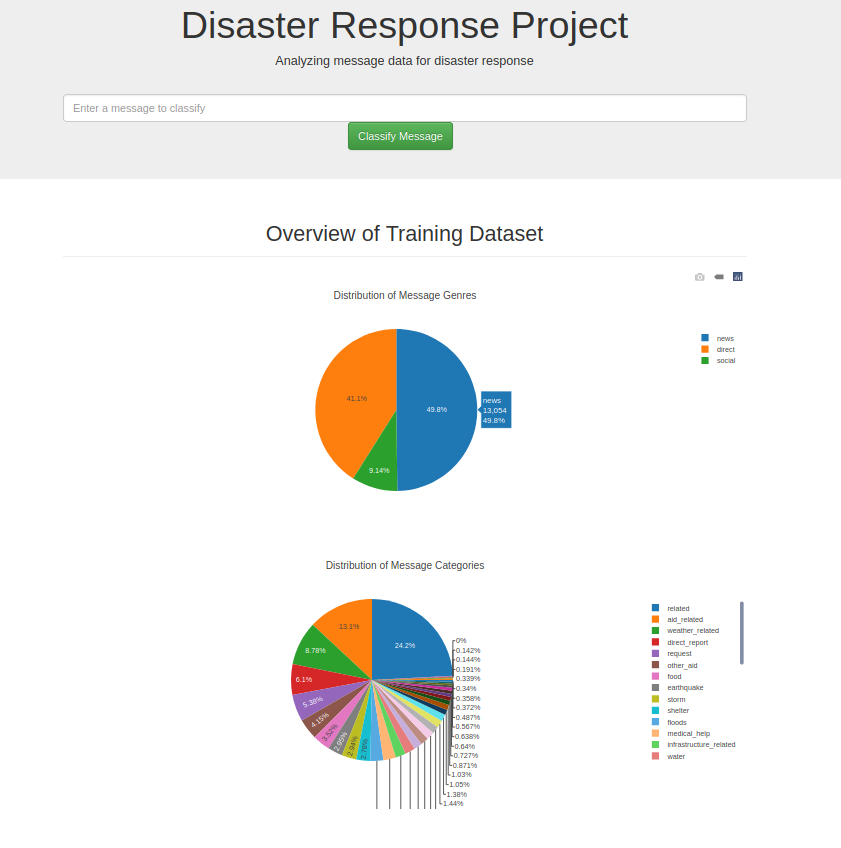

# [Disaster Response Pipelines](https://github.com/ifeelfree/disaster_response_pipeline) 

## Table of Contents

  - [Description](#description)
  - [How to install the application?](#how-to-install-the-application)
  - [How to execute the Jupyter Notebooks?](#how-to-execute-the-jupyter-notebooks)
  - [How to execute the Python scripts?](#how-to-execute-the-python-scripts)

## Description 
I set up this project devoted to Data Scientist Nanodegree Program by Udacity. 

The project is composed three parts:
- Part 1: generate a data pipeline both in Jupyter Notebook and Python script.
  
   The purpose is to implement ETL(Extract, Transform, and Load) pipeline, and so that we can generate a database ready for machine learning algorithms. 
- Part 2: generate a machine learning pipeline so that we can train a model for multiple class classification both in Jupyter Notebook and Python script.
  
  The project is about classifying a text paragraph into multiple categories (36). We are going to use traditional data preprocessing, feature extraction and machine learning algorithms empowered by NLTK and sk-learn libraries.

- Part 3: generate a Flask App to illustrate the training data, and demonstrate how the trained model can be employed in a real-time application.  

## How to install the application? 

The project's development environment is as follows: 
* Ubuntu 18.04 LTS
* Python 3.6+
* [package_list.txt](package_list.txt) 
  
You can use `conda create --name your_env_name --file package_list.txt ` to install the Python libraries that the project depends on. After that, you can download the project's source code with GIT. 

## How to execute the Jupyter Notebooks? 

(1) data preparation pipeline

[ETL Pipeline Preparation.ipynb](./data/ETL%20Pipeline%20Preparation.ipynb)

(2) machine learning model pipeline 

[ML Pipeline Preparation.ipynb](./models/ML%20Pipeline%20Preparation.ipynb)

(3) run app 

Go to **app** directory, and then  run `python run.py` 

Go to http://0.0.0.0:3001/

## How to execute the Python scripts? 

(1) data preparation pipeline

Go to **data** directory, and then run `python etl_pipeline.py`

(2) machine learning model pipeline 

 Go to **models** directory, and then run `python train_classifier.py`

(3) run app 

Go to **app** directory, and then  run `python run.py` 

Go to http://0.0.0.0:3001/

   

